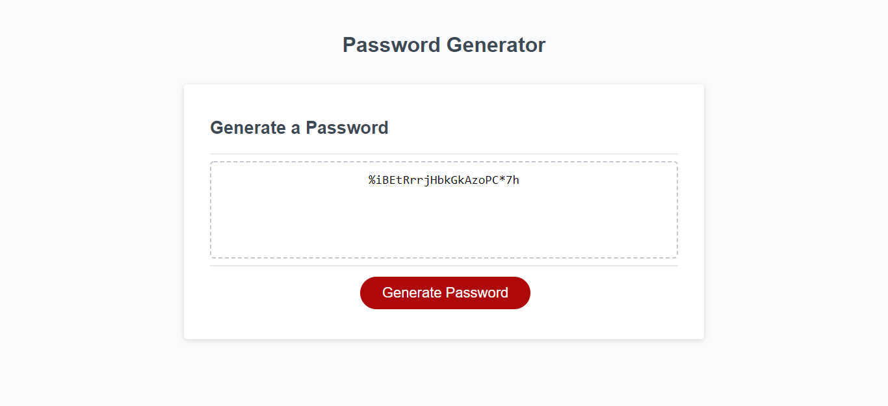

<h1>Password Generator Starter Code</h1>
    
This repo houses the codes used to build password generator, available at https://khklee.github.io/Password-Generator/. 

<h3>Website Description</h3>
    
Password-Generator randomly generate password based on criteria that the user provides when prompted. The application prompts the user to enter a length of a password and to include lowercase, uppercase, numbers, and/or special characters. 

<h3>Website Screenshot</h3>
    
